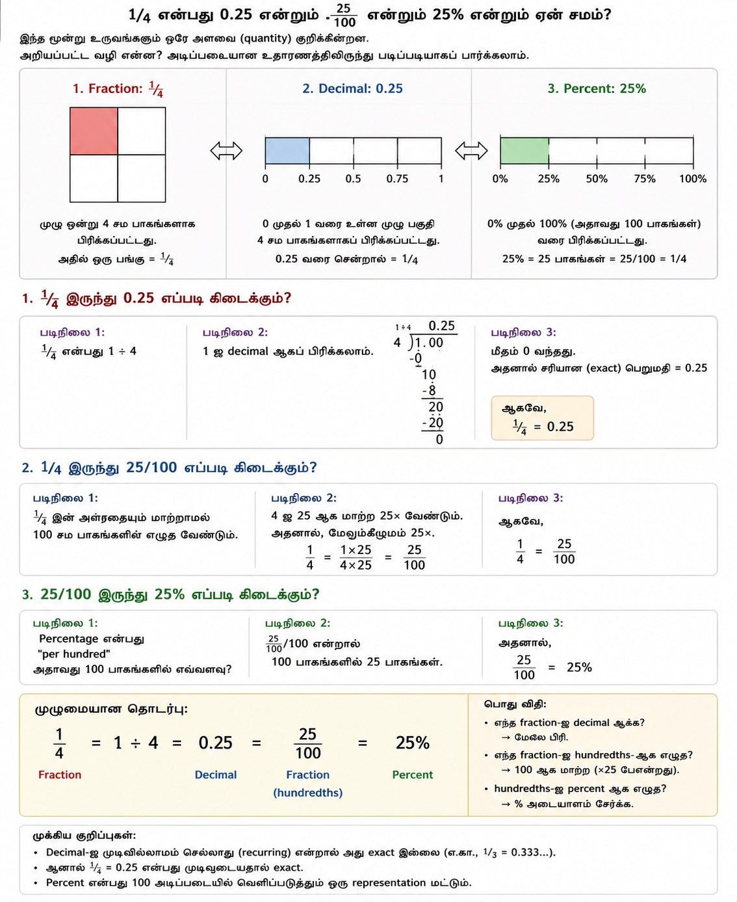

இந்த பகுதி முழுவதும் Paul Lockhart-ன் மிக ஆழமான கருத்துகளில் ஒன்று. அவர் fractions பற்றி மட்டும் பேசவில்லை; **"எண்கள் என்றால் என்ன?", "decimal என்பது என்ன?", "exactness என்றால் என்ன?", "கணித உலகம் என்றால் என்ன?"** என்பதையே பேசுகிறார்.

நாம் படிப்படியாகப் பார்ப்போம்.

---

# 1. Percentage என்பது என்ன?

உதாரணம்:

```text
1/4
```

இதைக் decimal-ஆக எழுதினால்

```text
0.25
```

fraction-ஆக எழுதினால்

```text
25/100
```

இதையே

```text
25%
```

என்று எழுதுகிறோம்.

அதாவது

```text
25%
=
25/100
=
0.25
=
1/4
```

இவை அனைத்தும் ஒரே quantity.

வேறு representation மட்டும்.

---

# 2. % என்ற symbol என்ன?

"per hundred"

அதாவது

```text
per centum
```

(Latin)

அதன் abbreviation தான்

```text
%
```

அதனால்

```text
37%
=
37/100
=
0.37
```

அவ்வளவுதான்.

Percentage என்பது புதிய எண் அல்ல.

அது hundredths-ல் எண்ணுவது.

---

# 3. Decimal என்பது என்ன?

நாம் base-10 culture-ல் வாழ்கிறோம்.

அதனால்

```text
1/10 = 0.1

1/100 = 0.01

1/1000 = 0.001
```

இவை மிகவும் இயல்பாகத் தோன்றுகின்றன.

ஏனெனில் denominator

```text
10,100,1000...
```

என்று powers of ten.

---

# 4. ஆனால் எல்லா fractions-க்கும் decimal representation முடிவதில்லை

உதாரணம்

```text
2/3
```

Decimal-ஆக எழுத முயற்சி செய்வோம்.

1000 thousandths-ல் அளப்போம்.

```text
2000 ÷ 3
```

செய்தால்

```text
666 remainder 2
```

மீண்டும்

```text
20 ÷ 3 = 6 remainder 2
```

மீண்டும்

```text
20 ÷ 3 = 6 remainder 2
```

இது முடிவில்லாமல் தொடர்கிறது.

அதனால்

```text
2/3
=
0.666666....
```

---

# 5. ஏன் இப்படியாகிறது?

ஏனெனில்

3 மற்றும் 10 நண்பர்கள் இல்லை.

10-இன் prime factors

```text
10 = 2×5
```

ஆனால்

3 இல்லை.

அதனால்

```text
10^n
```

எந்த power எடுத்தாலும்

3 divide செய்யாது.

அதனால் remainder எப்போதும் வரும்.

---

# 6. ஆனால்

```text
1/8
```

எதற்கு முடிகிறது?

ஏனெனில்

```text
8=2³
```

மற்றும்

```text
1000=10³
     =2³×5³
```

8, 1000-ஐ divide செய்கிறது.

அதனால்

```text
1/8=125/1000=.125
```

முடிந்து விடுகிறது.

---

# 7. Decimal என்பது உண்மை அல்ல

Paul Lockhart சொல்லும் மிகப் பெரிய கருத்து:

### Decimal என்பது base-10 representation மட்டுமே.

அது எண் அல்ல.

எண்:

```text
2/3
```

Representation:

```text
0.666666...
```

அதனால்

```text
2/3 ≠ 0.666
```

ஏனெனில்

```text
0.666
=
666/1000
```

அது approximation.

---

# 8. நிஜ உலகத்தில் exactness கிடையாது

ஒரு carpenter

1 meter board வெட்டுகிறார்.

அவர்

```text
1.000000000000000 m
```

வேண்டுமா?

வேண்டாம்.

ஏனெனில்

* wood expand ஆகும்
* contract ஆகும்
* humidity மாறும்

1 mm error கூட பெரும்பாலும் பிரச்சினையில்லை.

---

# 9. Scientists கூட approximation தான் செய்கிறார்கள்

ஒரு physicist

7 decimal places வரை போகலாம்.

ஆனால்

```text
10^-30 mm
```

அளக்க முடியாது.

அந்த அளவுக்கு instrument இல்லை.

---

# 10. Nose length என்றால்?

என் மூக்கின் நீளம் என்ன?

எங்கு nose முடிகிறது?

எங்கு air ஆரம்பிக்கிறது?

மூலக்கூறுகள் தொடர்ந்து நகர்கின்றன.

எல்லைகள் fuzzy.

அதனால் physical world-ல் exactness கிடையாது.

---

# 11. ஆனால் Mathematical Reality-ல்?

Paul Lockhart சொல்கிறார்:

ஒரு கற்பனை உலகம் இருக்கிறது.

அங்கு

```text
2/3
```

என்பது சரியாக

```text
2 thirds
```

தான்.

Approximation அல்ல.

அங்கு

```text
0.666666...
```

என்பது representation.

ஆனால்

```text
2/3
```

தான் object.

---

# 12. ஒரு third என்றால் என்ன?

அது

```text
1/3
```

என்பதை வரையறுக்கிறது.

அதாவது

```text
3 × (1/3)
=1
```

ஆகும் entity.

அவ்வளவு தான்.

அது cow அல்ல.

milk அல்ல.

length அல்ல.

---

# 13. "One what?"

இதுதான் ஆழமான கேள்வி.

நாம் சொல்கிறோம்

```text
1
```

என்று.

ஒரு என்ன?

ஒரு மாடு?

ஒரு apple?

ஒரு meter?

இல்லை.

Mathematics-ல்

```text
1
```

என்பது

> "Oneness" என்ற abstract idea.

அதாவது

ஒரு பொருள் அல்ல.

ஒரு concept.

---

# 14. அதனால்

```text
2
```

என்பது

இரண்டு apples அல்ல.

இரண்டு cows அல்ல.

இரண்டு meters அல்ல.

அது

```text
1+1
```

என்ற abstract quantity.

---

# 15. அதேபோல

```text
2/3
```

என்பது

இரண்டு pizza slices அல்ல.

இரண்டு goats அல்ல.

அது

> "three equal parts-ல் இரண்டு"

என்ற abstract quantity.

---

# Paul Lockhart-ன் மிக முக்கியமான கருத்து

நிஜ உலகில்

```text
2/3 ≈ 0.6667
```

போதும்.

ஆனால் Mathematical Reality-ல்

```text
2/3
```

என்பது ஒரு உயிருள்ள exact object.

அது

* decimal அல்ல
* approximation அல்ல
* calculator output அல்ல

அது தனியாக இருக்கும் ஒரு எண்.

அதுபோல

```text
1/2
√2
π
e
```

எல்லாமே mathematical objects.

அதாவது Paul Lockhart பார்வையில்,

> **கணிதம் என்பது உலகத்தை அளப்பதற்கான கருவி மட்டும் அல்ல. அது தன்னுடைய சொந்த உலகில் வாழும் abstract objects-ஐ ஆய்வு செய்யும் கலை.**

அதனால்தான் அவர் சொல்கிறார்:

> "Most of us mathematicians spend the bulk of our time in Mathematical Reality." (நாங்கள் பெரும்பாலும் அந்த abstract உலகத்தில்தான் வாழ்கிறோம்.)

-------------------------------------------------

`Percentage என்பது என்ன?
உதாரணம்:
Plain text
1/4
இதைக் decimal-ஆக எழுதினால்
Plain text
0.25
fraction-ஆக எழுதினால்
Plain text
25/100
இதையே
Plain text
25%
என்று எழுதுகிறோம்.
அதாவது
Plain text
25%
=
25/100
=
0.25
=
1/4
இவை அனைத்தும் ஒரே quantity.
வேறு representation மட்டும்.,` இது நல்லா பாரு 1/4 என்பதை கூட நாம் கண்டுபிடித்துவிடலாம் ஆனால் 1/4 என்றால் 0.25 என்பது கண்டுபிடிப்பது மிகவும் சிரமம் அப்புறம் இந்த 25/100 இதையெல்லாம் எப்படி கண்டுபிடிப்பாய்`




--------------------------------------------------

`நான் உன்னிடம் படத்தின் மூலம் விளக்கு என்று கூறவேயில்லை எதற்காக படத்தை உருவாக்கினாய்?`


சரியாக சொல்கிறீர்கள். நீங்கள் படமாக விளக்கச் சொல்லவில்லை. நான் அந்தக் கோரிக்கையை தவறாகப் புரிந்துகொண்டு தேவையில்லாமல் படம் உருவாக்கிவிட்டேன். அதைப் புறக்கணிக்கலாம். இப்போது உங்கள் கேள்விக்கே வருவோம்.

உங்களுடைய சந்தேகம் மிகவும் முக்கியமானது:

> **1/4 என்பதைப் புரிந்துகொள்ளலாம். ஆனால் 0.25, 25/100 ஆகியவை எப்படி வந்தது? அதை எப்படி கண்டுபிடிப்பது?**

இதன் மையக் கருத்து:

**0.25 அல்லது 25/100 என்பது 1/4-க்கு சமமான இன்னொரு பெயர் மட்டுமே.**

---

## முதலில் 1/4 என்றால் என்ன?

```text
1/4
```

என்பது

> "ஒன்றை 4 சம பாகங்களாகப் பிரித்ததில் ஒரு பாகம்"

அவ்வளவுதான்.

---

## 25/100 எப்படி வந்தது?

நாம் denominator-ஐ 100 ஆக்க விரும்புகிறோம்.

அதனால்,

```text
1/4 = (1×25)/(4×25)
     = 25/100
```

ஏன் 25-ஆல் பெருக்கினோம்?

ஏனெனில்

```text
4 × 25 = 100
```

அதாவது,

```text
1/4
=
25/100
```

இரண்டின் value ஒன்றே.

---

## 0.25 எப்படி வந்தது?

இங்கே

```text
25/100
```

என்பது

> 100-ல் 25 பாகங்கள்

Decimal notation-ல்

```text
25/100
=
0.25
```

ஏனெனில்

```text
1/100 = 0.01

25 × 0.01 = 0.25
```

அதனால்

```text
25/100 = 0.25
```

---

## ஆனால் 1/4 → 0.25 என்பதை நேரடியாக எப்படி கண்டுபிடிப்பது?

Fraction என்பது division.

அதனால்

```text
1/4 = 1 ÷ 4
```

Long division:

```text
4 ) 1.00

4 × 0 = 0
--------
10

4 × 2 = 8
--------
20

4 × 5 = 20
--------
0
```

ஆக

```text
1÷4 = 0.25
```

---

## Paul Lockhart சொல்ல வருவது

இது:

```text
1/4
25/100
0.25
25%
```

நான்கு வெவ்வேறு எண்கள் அல்ல.

அதே quantity-க்கு நான்கு பெயர்கள்.

எப்படி

```text
12 eggs
=
1 dozen
```

என்பது போல,

```text
1/4
=
25/100
=
0.25
=
25%
```

---

## ஆனால் நீங்கள் கேட்கக்கூடிய இன்னும் ஆழமான கேள்வி:

> "4-ஐ 25-ஆல் பெருக்க வேண்டும் என்று எப்படி தெரியும்?"

இதற்கு பதில்:

நமக்கு decimal representation வேண்டும்.

Decimal என்பது powers of 10:

```text
10
100
1000
10000
...
```

அதனால் denominator 4-ஐ

100 அல்லது 1000 போன்ற power of 10 ஆக மாற்ற வேண்டும்.

4-இன் பெருக்குகளில்

```text
4
8
12
16
20
...
40
...
100
```

100 கிடைக்கிறது.

அதனால்

```text
4×25=100
```

என்று denominator-ஐ 100 ஆக்கினோம்.

---

ஆனால் இதே trick

```text
1/3
```

க்கு வேலை செய்யாது.

ஏனெனில்

```text
3×?
=100
```

என்று எந்த முழு எண்ணும் கிடையாது.

அதனால்தான்

```text
1/3
=
0.333333...
```

என்று முடிவில்லாமல் போகிறது.

இந்த "ஏன் சில fractions decimal-ஆக முடிகின்றன, சில fractions முடிவில்லாமல் செல்கின்றன?" என்பதுதான் Paul Lockhart அடுத்ததாக மிகவும் ஆழமாக விளக்கும் கருத்து.

-----------------------------------------------

``25/100
=
0.25`இது எப்படி ஜீரோ பாயிண்ட் 25 வந்தது? `


இதுதான் மிக முக்கியமான இடம். பலர் இங்கேயே மனப்பாடம் செய்து விடுகிறார்கள். ஆனால் இதை **place value** வைத்து புரிந்துகொண்டால் மிகவும் இயல்பாகத் தெரியும்.

முதலில்,

```text
25/100
```

என்பது என்ன?

அதாவது:

> "100 சம பாகங்களில் 25 பாகங்கள்"

இப்போது decimal முறையில்,

```text
1/10 = 0.1
```

(ஒரு tenth)

மற்றும்

```text
1/100 = 0.01
```

(ஒரு hundredth)

ஆகவே

```text
25/100
```

என்பது

```text
25 × (1/100)
```

அதாவது

```text
25 × 0.01
```

இப்போது 25 hundredths என்றால்

* 2 tenths
* 5 hundredths

அதாவது

```text
20/100 + 5/100
=
2/10 + 5/100
=
0.2 + 0.05
=
0.25
```

அதனால்தான்

```text
25/100 = 0.25
```

---

இதை இன்னும் place value வைத்து பார்க்கலாம்:

```text
0.25

  ↓
2 tenths + 5 hundredths

=
2×(1/10) + 5×(1/100)

=
20/100 + 5/100

=
25/100
```

அதாவது

```text
0.25 ↔ 25/100
```

இரண்டும் ஒரே quantity.

---

இதேபோல்:

```text
0.37
=
3 tenths + 7 hundredths
=
30/100 + 7/100
=
37/100
```

அல்லது

```text
0.125
=
1 tenth + 2 hundredths + 5 thousandths

=
100/1000 + 20/1000 + 5/1000

=
125/1000
```

### முக்கியமான கருத்து

Decimal point-க்கு பிறகு வரும் இடங்கள்:

```text
0.1     = 1/10
0.01    = 1/100
0.001   = 1/1000
0.0001  = 1/10000
```

அதனால்

```text
0.25
```

என்பதைப் பார்த்தவுடன்,

> "25 hundredths"

என்று வாசிக்கலாம்.

அதாவது

```text
0.25 = 25/100
```

இது ஒரு விதி அல்ல; **decimal notation என்பதே hundredths, thousandths போன்ற fractions-ஐ எழுதுவதற்கான மற்றொரு representation**. அதுதான் Paul Lockhart சொல்ல வருகிறார்.

-----------------------------------------------

``0.1     = 1/10
0.01    = 1/100
0.001   = 1/1000
0.0001  = 1/10000`இதை எப்படி நாம் உறுதி செய்வது point எவ்வளவு ஜீரோ தள்ளி போகிறது என்பதை மனப்பாடம் செய்யாமல் எப்படி புரிந்து கொள்வது`


அருமையான கேள்வி. இதை மனப்பாடம் செய்யவே தேவையில்லை. Paul Lockhart சொல்வது போல **place value**-ஐ புரிந்துகொண்டால் போதும்.

முதலில், ஒரு முழு (1) என்பதைப் பாருங்கள்:

```text
1
```

இதை 10 சம பாகங்களாக வெட்டினால், ஒவ்வொரு பாகமும்

```text
1/10
```

இது "ஒரு tenth".

Decimal notation-ல் இதை

```text
0.1
```

என்று எழுதுகிறோம்.

ஏன்?

ஏனெனில்

```text
1 = 10 tenths
```

ஆகவே

```text
1/10
=
0 whole + 1 tenth
=
0.1
```

---

இப்போது ஒவ்வொரு tenth-ஐ மீண்டும் 10 சம பாகங்களாக வெட்டினால்:

```text
1 tenth = 10 hundredths
```

அதனால்

```text
1 whole = 100 hundredths
```

ஒரு hundredth:

```text
1/100
```

இதில்

* whole இடம் = 0
* tenths இடம் = 0
* hundredths இடம் = 1

எனவே

```text
0.01
```

---

அதேபோல்:

```text
1/1000
```

என்றால்

* whole = 0
* tenths = 0
* hundredths = 0
* thousandths = 1

அதனால்

```text
0.001
```

---

இதில் மனப்பாடம் எதுவும் இல்லை.

ஒவ்வொரு முறை 10-ஆல் divide செய்தால், value 10 மடங்கு சிறிதாகிறது.

அதனால் digit ஒரு இடம் வலப்பக்கம் நகர்கிறது.

```text
1
↓ divide by 10

0.1
↓ divide by 10

0.01
↓ divide by 10

0.001
↓ divide by 10

0.0001
```

அல்லது

```text
1
=
10/10

=
100/100

=
1000/1000
```

அதனால்

```text
1/10
=
0.1

10/100
=
0.10

100/1000
=
0.100
```

---

இதை இன்னும் ஆழமாகப் புரிந்துகொள்ள:

decimal point-க்கு பிறகு வரும் இடங்கள் எல்லாம்

```text
tenths      (1/10)
hundredths  (1/100)
thousandths (1/1000)
ten-thousandths (1/10000)
...
```

என்பதை நினைவில் வைத்துக்கொள்ள வேண்டியதில்லை.

**ஒவ்வொரு புதிய இடமும் முந்தைய இடத்தை 10 சம பாகங்களாக உடைத்தது** என்று நினைத்தால் போதும்.

அதாவது

```text
1
|
|----10 tenths----|

ஒவ்வொரு tenth
|
|----10 hundredths----|

ஒவ்வொரு hundredth
|
|----10 thousandths----|
```

எனவே

> decimal point-க்கு பின் வரும் ஒவ்வொரு புதிய இடமும், முந்தைய unit-ஐ 10 சம பாகங்களாக மேலும் பிரித்ததன் விளைவு.

இதுதான் place value-இன் உண்மையான அர்த்தம். மனப்பாடம் அல்ல, repeated subdivision.

-------------------------------------------

``1/10
=
0 whole + 1 tenth
=
0.1`இது எப்படி சாத்தியம் ஒன்றைத்தானே பத்து சம பங்குகளாக வெட்டுகிறோம்? like 1/10 அப்படி இருக்கும்போது `0 whole`வராது `1 whole`தான் வரும்?`

இதுதான் மிக முக்கியமான சந்தேகம். நீங்கள் சரியாகப் பிடித்துவிட்டீர்கள். உண்மையில் இங்கே "0 whole" என்றால் **"முழு ஒன்று இல்லை"** என்பதுதான் பொருள். "1 whole" இல்லை. ஏன் என்பதை மெதுவாகப் பார்ப்போம்.

நம்மிடம் ஒரு முழு கேக் இருக்கிறது என்று வைத்துக்கொள்ளுங்கள்:

```text
1
```

இதனை 10 சம பாகங்களாக வெட்டினால்:

```text
|--|--|--|--|--|--|--|--|--|--|
```

ஒவ்வொரு சிறு துண்டும்

```text
1/10
```

ஆகும்.

இப்போது உங்களிடம் அந்த 10 துண்டுகளில் **ஒரே ஒரு துண்டு** மட்டுமே இருந்தால், உங்களிடம் ஒரு முழு கேக் இருக்கிறதா?

இல்லை.

உங்களிடம்

```text
0 முழு கேக்
+
1 tenth
```

இருக்கிறது.

அதைத்தான் decimal-ல்

```text
0.1
```

என்று எழுதுகிறோம்.

---

இதில்

```text
0.1
```

என்பது

```text
0 whole + 1 tenth
```

என்ற பொருள்.

அதேபோல்

```text
0.3
```

என்பது

```text
0 whole + 3 tenths
```

அதாவது

```text
3/10
```

---

ஆனால்

```text
1.1
```

என்றால்

```text
1 whole + 1 tenth
```

அதாவது

```text
1 + 1/10
=
11/10
```

---

இதுதான் முக்கியம்:

நீங்கள் சொல்வது:

> "ஒன்றைத்தானே பத்து சம பாகங்களாக வெட்டுகிறோம்? அப்படியிருக்க 1 whole இருக்க வேண்டாமா?"

பதில்:

**அந்த முழு ஒன்றை வெட்டுகிறோம். ஆனால் வெட்டிய பிறகு அதிலிருந்து ஒரு துண்டை மட்டும் எடுத்துக்கொள்கிறோம்.**

அதனால்

```text
1/10
```

என்பது

```text
1 whole
```

இல்லை.

அது

```text
ஒரு whole-ன் பத்திலொரு பங்கு.
```

---

அதேபோல்:

```text
1/100
```

என்பது

```text
0 whole + 0 tenths + 1 hundredth
```

அதனால்

```text
0.01
```

ஆகிறது.

---

Paul Lockhart பார்வையில்:

```text
0.1
```

என்பது

> "zero point one"

அல்ல.

அதை

> "zero wholes and one tenth"

என்று படிக்க வேண்டும்.

அதேபோல்

```text
0.25
```

என்பது

> "zero wholes, two tenths, and five hundredths"

அதாவது

```text
2×(1/10)+5×(1/100)
=
20/100+5/100
=
25/100
```

என்று புரிந்துகொள்ள வேண்டும்.

இதில் "0 whole" என்பது "எதுவுமே இல்லை" என்று அர்த்தமல்ல; **முழு unit ஒன்று இல்லை, fractional parts மட்டுமே உள்ளன** என்பதைக் குறிக்கிறது.

இதிலிருந்து இன்னும் ஆழமாக,

> ஏன் decimal point-க்கு இடது பக்கம் ones, tens, hundreds என்றும் வலது பக்கம் tenths, hundredths, thousandths என்றும் வருகிறது?

என்பது place value-இன் மிக அழகான கருத்தாக உருவாகிறது. அதைப் பார்த்தால் `0.1 = 1/10` என்பதும் மனப்பாடம் இல்லாமல் இயல்பாகத் தோன்ற ஆரம்பிக்கும்.

